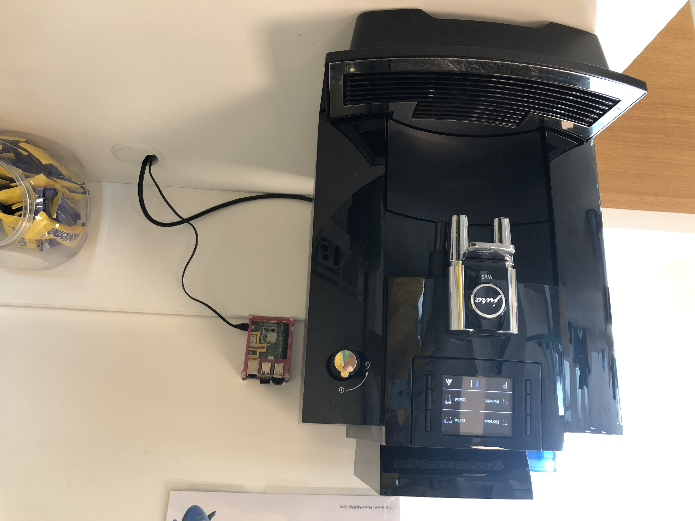

[](https://dataroots.io)
 

# Fresh-Coffee-Listener

A typical datarootsian consumes high-quality fresh coffee in their office environment. The board of dataroots had
a very critical decision by the end of 2021-Q2 regarding coffee consumption. From now on, the total number of coffee
consumption stats have to be audited live via listening to the coffee grinder sound in Raspberry Pi, because why not? 
Check stats from [here](https://app.cumul.io/s/coffeeometer-lejpayjm3rdjgtiu).

## Overall flow to collect coffee machine stats
1. Relocate the Raspberry Pi microphone just next to the coffee machine
2. Listen and record environment sound at every 0.7 seconds
3. Compare the recorded environment sound with the original coffee grinder sound and measure the 
   Euclidean distance
4. If the distance is less than a threshold it means that the coffee machine has been started and a 
   datarootsian is grabbing a coffee
5. Connect to DB and send timestamp, office name, and serving type to the DB in case an event is detected (
   E.g. 2021-08-04 18:03:57, Leuven, coffee
   )
   
## Raspberry Pi Setup


1. **Hardware**: Raspberry Pi 3b
2. **Microphone**: External USB microphone (doesn't have to be a high-quality one). We also bought a 
   microphone with an audio jack but apparently, the Raspberry Pi audio jack doesn't have an input. So, don't do the same mistake and just go for the USB one :)
3. **OS**: Raspbian OS
4. **Python Version**: Python 3.7.3. We used the default Python3 since we don't have any other python projects in the same Raspberry Pi. You may also create a virtual environment.
   
## Detecting the Coffee Machine Sound
1. In the `sounds` folder, there is a `coffee-sound.m4a` file, which is the recording of the coffee machine grinding sound for 1 sec. You need to replace this recording with your coffee machine recording. It is very important to note that record the coffee machine sound with the external microphone that you will use in Raspberry Pi to have a much better performance.
2. When we run `detect_sound.py`, it first reads the `coffee-sound.m4a` file and extracts its [MFCC](https://en.wikipedia.org/wiki/Mel-frequency_cepstrum) features.
By default, it extracts 20 MFCC features. Let's call these features `original sound features`
3. The external microphone starts listening to the environment for about 0.7 seconds with a 44100 sample rate. Note
that the 44100 sample rate is quite overkilling but Raspberry Pi doesn't support lower sample rates out of the box.
To make it simple we prefer to use a 44100 sample rate.
4. After each record, we also extract 20 `MFCC` features and compute the [Euclidean Distance](https://en.wikipedia.org/wiki/Euclidean_distance#:~:text=In%20mathematics%2C%20the%20Euclidean%20distance,being%20called%20the%20Pythagorean%20distance.)
between the `original sound features` and `recorded sound features`.
5. We append the `Euclidean Distance` to a [python deque object](https://docs.python.org/3/library/collections.html#collections.deque)
having size 3. 
6. If the maximum distance in this deque is less than `self.DIST_THRESHOLD = 85`, then it means that there is a 
coffee machine usage attempt. Feel free to play with this threshold based on your requirements. You can simply
comment out `line 66` of `detect_sound.py` to print the deque object and try to select the best threshold. We prefer
to check 3 events (i.e having deque size=3) subsequently to make it more resilient to similar sounds.    
7. Go back to step 3, if the elapsed time is < 12 hours. (Assuming that the code will run at 7 AM and ends at 7 PM 
   since no one will be at the office after 7 PM)
8. Exit

## Scheduling the coffee listening job
We use a systemd service and timer to schedule the running of `detect_sound.py`. Please check `coffee_machine_service.service` 
and `coffee_machine_service.timer` files. This timer is enabled in the `makefile`. It means that even if you reboot your
machine, the app will still work. 

#### coffee_machine_service.service
In this file, you need to set the correct `USER` and `WorkingDirectory`. In our case, our settings are; 

```shell
User=pi
WorkingDirectory= /home/pi/coffee-machine-monitoring
```
To make the app robust, we set `Restart=on-failure`. So, the service will restart if something goes wrong in the app. (E.g power outage, someone plugs out the microphone and plug in again, etc.). This service will trigger `make run`
the command that we will cover in the following sections.

#### coffee_machine_service.timer
The purpose of this file is to schedule the starting time of the app. As you see in;
```shell
OnCalendar=Mon..Fri 07:00
```
It means that the app will work every weekday at 7 AM. Each run will take 7 hours. So, the app will complete 
listening at 7 PM.

## Setup a PostgreSQL Database
You can set up a PostgreSQL database at any remote platform like an on-prem server, cloud, etc. It is not advised to install it to
Raspberry Pi.
1. Install and setup a PostgreSQL server by following the [official documentation](https://www.postgresql.org/docs/current/tutorial-install.html)
   
2. Create a database by typing the following command to the PostgreSQL console and replace `DB_NAME` with your database name;
   ```
   createdb DB_NAME
   ```
   If you got an error, check [here](https://www.postgresql.org/docs/current/tutorial-createdb.html)
   
3. Create a table by running the following query in your PostgreSQL console by replacing `DB_NAME` and `TABLE_NAME` with
your own preference;
   ```postgresql
   CREATE TABLE DB_NAME.TABLE_NAME (
       "timestamp" timestamp(0) NOT NULL,
       office varchar NOT NULL,
       serving_type varchar NOT NULL
   );
   ```
4. Create a user, password and give read/write access by replacing `DB_USER`, `DB_PASSWORD`, `DB_NAME` and `DB_TABLE`
   ```postgresql
   create user DB_USER with password 'DB_PASSWORD';
   grant select, insert, update on DB_NAME.DB_TABLE to DB_USER;
   ```

## Deploying Fresh-Coffee-Listener app
1. **Installing dependencies**: If you are using an ARM-based device like Raspberry-Pi run 
   ```shell
   make install-arm
   ```
   For other devices having X84 architecture, you can simply run
   ```shell
   make install
   ```

2. **Set Variables in makefile**
   -  `COFFEE_AUDIO_PATH`: The absolute path of the original coffee machine sound (E.g. `/home/pi/coffee-machine-monitoring/sounds/coffee-sound.m4a`)
   -  `SD_DEFAULT_DEVICE`: It is an integer value represents the sounddevice input device number. To find your external device number, run
   `python3 -m sounddevice` and you will see something like below;
      ```shell
         0 bcm2835 HDMI 1: - (hw:0,0), ALSA (0 in, 8 out)
         1 bcm2835 Headphones: - (hw:1,0), ALSA (0 in, 8 out)
         2 USB PnP Sound Device: Audio (hw:2,0), ALSA (1 in, 0 out)
         3 sysdefault, ALSA (0 in, 128 out)
         4 lavrate, ALSA (0 in, 128 out)
         5 samplerate, ALSA (0 in, 128 out)
         6 speexrate, ALSA (0 in, 128 out)
         7 pulse, ALSA (32 in, 32 out)
         8 upmix, ALSA (0 in, 8 out)
         9 vdownmix, ALSA (0 in, 6 out)
        10 dmix, ALSA (0 in, 2 out)
      * 11 default, ALSA (32 in, 32 out)
      ```
   It means that our default device is `2` since the name of the external device is `USB PnP Sound Device`. So, we will 
   set it as `SD_DEFAULT_DEVICE=2` in our case.
   - `OFFICE_NAME`: it's a string value like `Leuven office`
   - `DB_USER`: Your PostgreSQL database username
   - `DB_PASSWORD`: the password of the specified user
   - `DB_HOST`: The host of the database
   - `DB_PORT`: Port number of the database
   - `DB_NAME`: Name of the database
   - `DB_TABLE`: Name of the table
   
3. **Sanity check**: Run `make run` to see if the app works as expected. You can also have a coffee to test whether it captures 
   the coffee machine sound.
   
4. **Enabling systemd commands to schedule jobs**: After configuring `coffee_machine_service.service` and 
`coffee_machine_service.timer` based on your preferences, as shown above, run to fully deploy the app;
   ```shell
   make run-systemctl
   ```
5. Check the `coffee_machine.logs` file under the project root directory, if the app works as expected
6. Check service and timer status with the following commands
   ```shell
   systemctl status coffee_machine_service.service
   ```
   and
   ```shell
   systemctl status coffee_machine_service.timer
   ```
   
## Having Questions / Improvements ?
Feel free to create an issue and we will do our best to help your coffee machine as well :)
